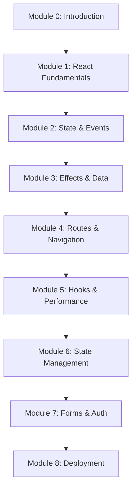

import { Badge } from "@/components/ui/badge";
import { Button } from "@/components/ui/button";
import { Steps, Step } from "@/components/steps";
import { Accordions, Accordion } from "@/components/accordion";

# Module 0 - Introduction

   <Badge variant='primary'>5 Lessons</Badge>
   <Badge variant='default'>15 Minutes</Badge>
   <Badge variant='success'>Beginner</Badge>

Welcome to **Project React**! This module introduces you to the course
structure, sets up your development environment, and prepares you to build a
modern React application.

## What You'll Learn

<Steps>
   <Step>
      ### 📚 Course Overview Understand the course structure, learning
      methodology, and what you'll build
   </Step>

   <Step>
      ### 🛠️ Environment Setup Install Node.js, set up your code editor, and
      prepare your development environment
   </Step>

   <Step>
      ### ⚛️ Understanding React Learn what React is, why it's popular, and how
      it works
   </Step>

   <Step>
      ### 🎯 Project Overview See the final application and understand the
      features you'll build
   </Step>

   <Step>
      ### 🚀 Getting Started Bootstrap your first React project and understand
      the file structure
   </Step>
</Steps>

## About This Course

### Project-Based Learning

Unlike traditional courses that teach concepts in isolation, you'll learn React
by building a **real-world booking application**. Every lesson adds a new
feature or improves existing functionality.

<Accordions>
   <Accordion title='What makes this course different?'>
      - **Real Project**: Build a production-ready application, not toy examples
      - **Hands-On**: Write code in every lesson - **Incremental**: Each step
      builds on the previous - **Explained**: Understand the "why" behind every
      decision - **Modern**: Uses latest React patterns and best practices
   </Accordion>

   <Accordion title='Who is this course for?'>
      This course is ideal for: - Developers with JavaScript knowledge wanting
      to learn React - Frontend developers transitioning to React - Students
      building their portfolio - Anyone wanting to build modern web applications
   </Accordion>

   <Accordion title='What will you build?'>
      A booking application with these features: - Property listings with search
      and filters - Detailed property pages with image carousels - User
      authentication and protected routes - Favorites system with global state
      management - Responsive design that works on all devices - Production
      deployment to Vercel
   </Accordion>
</Accordions>

## Module Structure

Each module follows a consistent pattern:

1. **Introduction** - Overview and context
2. **Step-by-Step Lessons** - Guided implementation
3. **Code Examples** - Copy-paste ready code
4. **Explanations** - Deep dive into concepts
5. **Verification** - Test your progress
6. **Completion** - Summary and next steps

## Prerequisites

Before starting, ensure you have:

-  ✅ Basic JavaScript knowledge (variables, functions, arrays, objects)
-  ✅ Understanding of HTML & CSS
-  ✅ Familiarity with ES6+ features (arrow functions, destructuring, modules)
-  ✅ A computer with admin access to install software

Don't worry if you're not an expert - we'll explain everything as we go!

## Learning Path

## Time Commitment

-  **This Module**: ~15 minutes
-  **Per Lesson**: 2-5 minutes
-  **Full Course**: 25-30 hours
-  **Pace**: Work at your own speed

## Getting Help

If you get stuck:

1. **Re-read the lesson** - Often the answer is there
2. **Check the code examples** - Compare with your code
3. **Review previous lessons** - Build on solid foundations
4. **Search the error** - Google is your friend
5. **Take a break** - Fresh eyes help

## Ready to Begin?

Let's start by setting up your development environment!

   <Button size='lg' asChild>
      <a href='/docs/react/m0/1_welcome'>Lesson 1: Welcome →</a>
   </Button>

