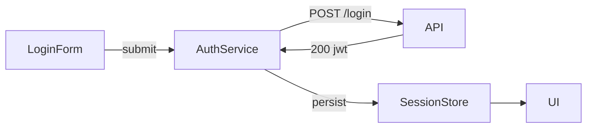
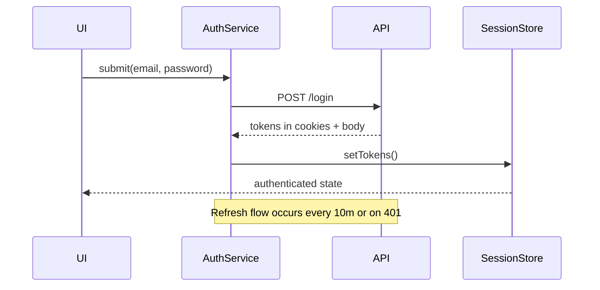

import { Accordions, Accordion } from "@/components/accordion";

# Authentication Foundations

## Learning Objectives

By the end of this lesson, you will:

-  [ ] Map the authentication flows required by stakeholders.
-  [ ] Document security requirements (MFA readiness, auditing).
-  [ ] Decide session lifetime and storage strategy.
-  [ ] Plan analytics for login success/failure.

## Auth Flow Inventory

| Flow           | Trigger              | Notes                         |
| -------------- | -------------------- | ----------------------------- |
| Login          | Email + password     | Optional remember-me checkbox |
| Reset password | Forgot password link | Email verification + OTP      |
| Invite accept  | Email invite         | Pre-fill email, set password  |
| Logout         | Manual or inactivity | Confirm dialog, audit event   |

---

## Security Requirements

-  TLS enforced, no mixed content.
-  Store tokens in httpOnly cookies with SameSite=Lax.
-  Support MFA (email code) in future module.
-  Implement rate limiting on login/reset endpoints.

---

## Session Strategy

-  Short-lived access token (15 min) + refresh token (24h).
-  Refresh token stored in secure cookie; rotate on use.
-  Persist session state using Zustand store + HTTP-only cookie handshake.

<Accordions type='single' className='mt-4'>
   <Accordion title='TaskFlow Pro Auth Plan'>
      <p>Log decisions for implementation reference.</p>

      ```md filename="notes/module-7-forms-auth-plan.md"
      ## Authentication Decisions
      - Token format: JWT signed with HS256
      - Storage: httpOnly cookies + in-memory access token
      - Session timeout: 24h refresh, 15m access
      - Audit: record login success/failure via analytics client
      ```

   </Accordion>
</Accordions>

---

## Architecture Overview



-  `LoginForm`: React Hook Form + Zod for validation.
-  `AuthService`: Handles HTTP calls via Axios, includes interceptors.
-  `SessionStore`: Zustand store synced with `AuthContext`.

---

## Backend Contracts

| Endpoint       | Method | Request               | Response                        |
| -------------- | ------ | --------------------- | ------------------------------- |
| `/api/login`   | POST   | `{ email, password }` | `{ accessToken, refreshToken }` |
| `/api/logout`  | POST   | `refreshToken` cookie | `{ success: true }`             |
| `/api/refresh` | POST   | `refreshToken` cookie | `{ accessToken }`               |
| `/api/invite`  | POST   | `{ email }`           | `{ status }`                    |



---

## Authentication UX Principles

-  Login: brand header, credential fields, remember-me, forgot password link.
-  Reset: email input, success state copy, back-to-login CTA.
-  Invite: context copy clarifying inviter and workspace.

1. Trust first: explain why data is needed.
2. Clarity: show inline validation with actionable text.
3. Safety: mask passwords, provide show/hide toggle.
4. Recovery: always offer help channel link.

Accessibility:

-  Use semantic `<form>` with grouped `<fieldset>`.
-  Ensure tab order matches visual flow.
-  Announce errors via `aria-live="assertive"`.
-  Support high contrast mode and keyboard shortcuts.

Analytics instrumentation plan:

```ts filename="src/lib/analytics.ts"
export const trackAuthEvent = (
   event: "login_success" | "login_error" | "reset_request"
) => {
   window.analytics?.track(event, {
      timestamp: new Date().toISOString(),
      source: "taskflow-pro-web",
   });
};
```

---

## ✅ Validation Checklist

-  [ ] Auth flows enumerated with owners.
-  [ ] Security requirements approved by platform.
-  [ ] Architecture and UX decisions logged.

---

